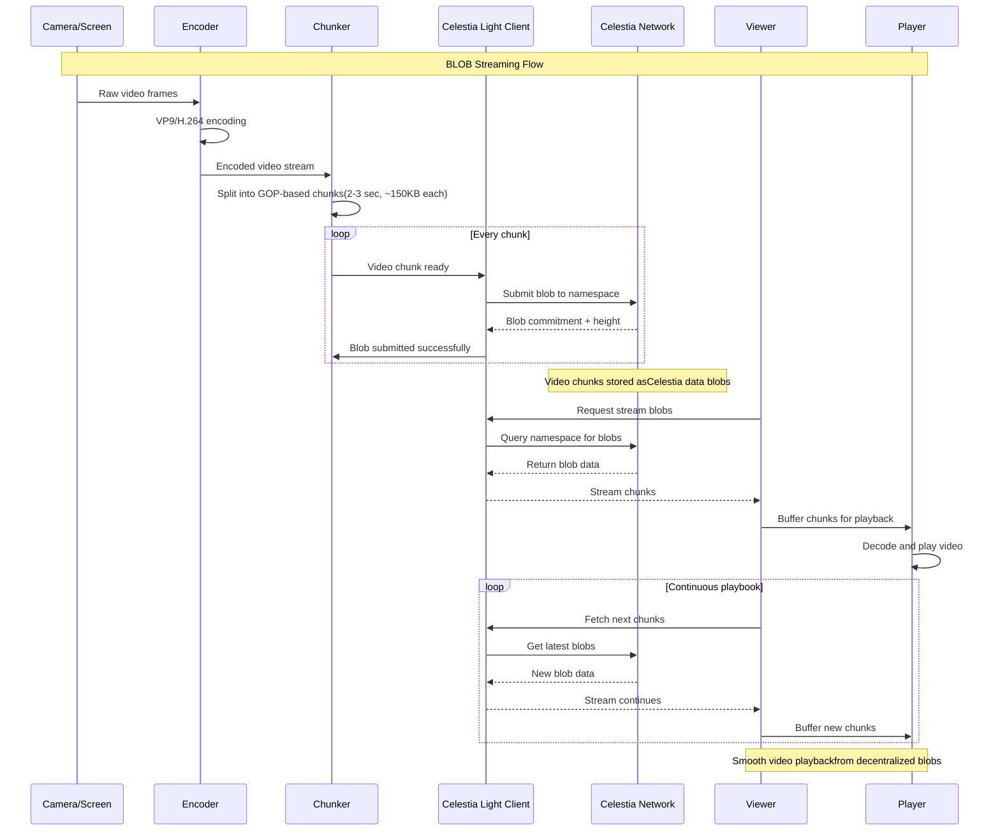

# BLOB 🌌
**B**lockchain **L**ive **O**nchain **B**roadcasting

*"Stream it like you blob it"*

---

## 🎯 What is BLOB?

BLOB is a decentralized streaming platform built on Celestia's data availability layer. Unlike traditional streaming services, BLOB stores video content directly on-chain as data blobs, ensuring true decentralization, censorship resistance, and verifiable streaming.

## 🔥 Why BLOB Matters

The streaming industry is dominated by centralized platforms that control content, monetization, and user data. BLOB changes the game by putting power back into creators' and viewers' hands.

### Current Problems with Web2 Streaming:
- **Centralized Control**: Platforms can ban creators or remove content arbitrarily
- **Revenue Monopoly**: 30-50% platform fees, opaque revenue sharing
- **Data Ownership**: Users and creators don't own their content or viewing data
- **Geographic Restrictions**: Content blocked by region or government censorship
- **Algorithm Manipulation**: Views and recommendations controlled by platform algorithms
- **Single Point of Failure**: Platform downtime affects millions of users

## ✨ BLOB Advantages

### 🔒 **True Decentralization**
- Content stored on Celestia's distributed network
- No single entity can censor or remove streams
- Unstoppable broadcasting for creators worldwide

### 💰 **Fair Economics**
- Direct creator-to-viewer payments
- Transparent revenue distribution
- No hidden platform fees
- Micro-payments for per-minute viewing

### 🔍 **Verifiable Streaming**
- All viewing metrics are on-chain and auditable
- Impossible to fake views or engagement
- Cryptographic proof of content authenticity

### 🌍 **Global Access**
- Accessible from anywhere with internet
- No geographic restrictions or local bans
- Resistant to government censorship

### 📊 **Data Ownership**
- Creators own their content and viewer data
- Users control their viewing history and preferences
- No data harvesting by centralized entities

## 🛠 Technical Approach

### Architecture Overview




### 1. **Stream Capture & Encoding**
- Real-time video capture from camera or screen sharing
- VP9/H.264 encoding optimized for streaming
- Adaptive bitrate based on network conditions

### 2. **Intelligent Chunking**
```go
Video Stream → GOP-based Chunks (2-3 seconds each)
Each Chunk:
├── Self-contained video segment
├── Starts with keyframe
├── ~100-150KB size
└── Playable independently
```

### 3. **Celestia Integration**
- Each video chunk becomes a Celestia data blob
- Namespaced organization for stream discovery
- Light client verification for instant access
- Blob commitments provide cryptographic guarantees

### 4. **Decentralized Playback**
- Viewers fetch blobs directly from Celestia network
- Buffer management for smooth playback
- No CDN or centralized infrastructure needed

## 🚀 Key Features

### For Streamers:
- **Zero Platform Risk**: Your content can't be deleted or banned
- **Direct Monetization**: Set your own prices, keep 100% of revenue
- **Global Reach**: Stream to anyone, anywhere in the world
- **Verifiable Metrics**: Honest, auditable view counts and engagement

### For Viewers:
- **Pay-per-View**: Only pay for content you actually watch
- **Censorship-Free**: Access any content without geographic restrictions
- **Privacy First**: Your viewing habits aren't tracked or sold
- **Quality Assurance**: Cryptographically verified authentic content

## 🏗 Technical Stack

- **Video Processing**: GoCV for camera capture and video processing
- **Encoding**: VP9/H.264 with GOP-based chunking
- **Blockchain**: Celestia for data availability and blob storage
- **Frontend**: Web-based player with light client integration
- **Backend**: Go-based streaming and blob management services


---
*Stream. Store. Verify.*
